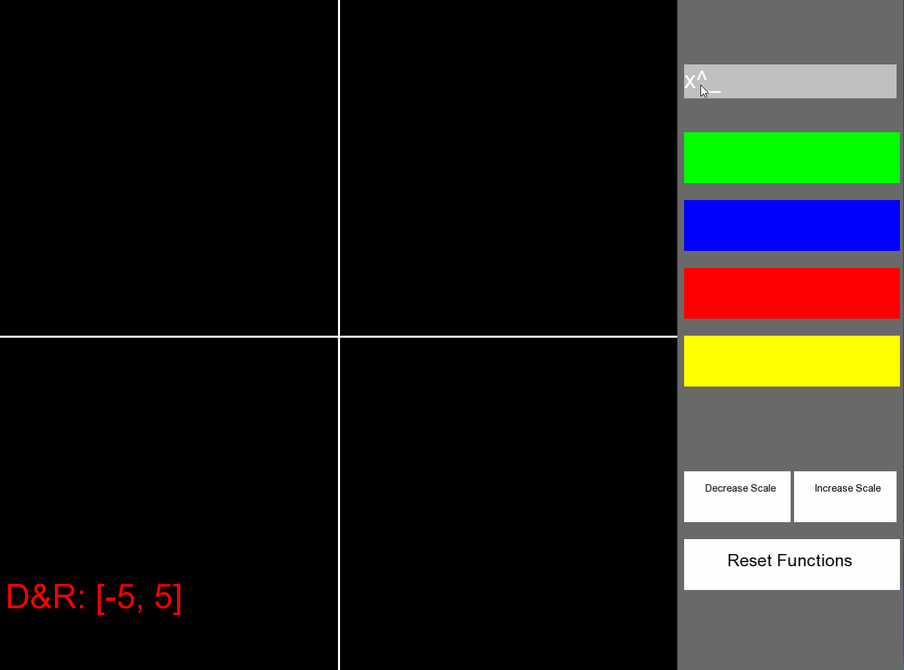

# SFML Graphing Calculator🖩
## By: <ins> Jose Gonzalez </ins>
The Project is used to graph functions. It is a calculator that can graph up to four functions at a time.
The user can also change the scaling of the graph.

## Installation

- Instructions to install SFML on your computer can be found [here](https://www.sfml-dev.org/tutorials/2.5/start-linux.php).
- Clone the repository by 

## Usage
- To run the graphing calculator, use the keyboard to type in equations.

-

## Features

  

- Implemented:
  - Mostly everything has been implemented. 
  - I included the ability to increase and decrease the scaling of the graph.
  - I allowed for the ability to see up to four functions.
    - each are color coded.
  - the functions are repainted every time the scaling changes
  - accurate mapping due to careful manipulation of the constants that hold the screen width and height

 

- Partly implemented:
  - the line has spaces.

 

- Bugs
  - Just the fact that the circles are nearly invisible for tan(x)

